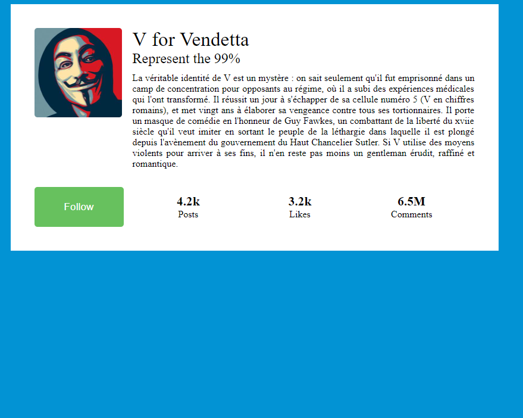
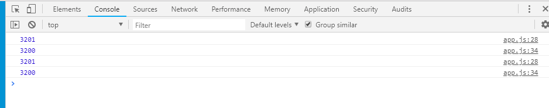

# Labo 01 - From mockup to HTML - Fork Lechaire Thomas

The objective of this lab is to get familiar with HTML, CSS and bit of Javascript. Your task as a front-end developer is to integrate a widget concept provided by your companie's UX/UI department. 

### Explainations

First Labo of the TWEB course 2018

Using FlexBox and Css for Layout - JavaScript and console to make the small interaction (console to verify that the action is working)

